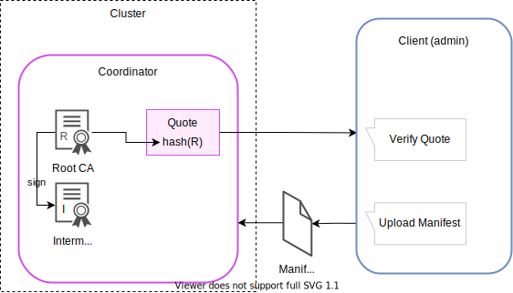

# Attestation

Hardware-rooted *remote attestation* is a key ingredient for distributed confidential apps. Marblerun relies heavily on the [Data Center Attestation Primitives (DCAP)](https://download.01.org/intel-sgx/sgx-dcap/1.9/linux/docs/Intel_SGX_DCAP_ECDSA_Orientation.pdf) of the latest SGX-enabled Intel Xeon processors.
At the time of writing, only Microsoft Azure had a public DCAP service deployed in their data centers. Hence, our demos are heavily tested and deployed on Azure Kubernetes Service (AKS).
However, Marblerun works with any DCAP service complying with the SGX specification. You can read more about setting up your own DCAP infrastructure [in the Intel SGX development articles](https://software.intel.com/content/www/us/en/develop/articles/intel-software-guard-extensions-data-center-attestation-primitives-quick-install-guide.html).

## Coordinator deployment

Initially, the Marblerun Coordinator is deployed to the cluster.
The Coordinator generates an X.509 certificate chain with a root and intermediate certificate authority (CA).
It generates a remote attestation quote which contains the hash of the root certificate as well as a hardware measurement of its enclave.

The admin receives the quote and verifies the Coordinator's integrity via the measurement. Next, they verify that the quote contains the root certificate’s hash. This ensures that the certificate was indeed generated by this Coordinator and was not manipulated during transport.

After the successful verification of the Coordinator, the manifest can be uploaded to the cluster.
The [manifest](workflows/define-manifest.md) describes which Marbles (services) should be deployed to your cluster. It contains their enclaves’ build-time measurements.

## Marble deployment and attestation

The Coordinator enforces the manifest and only admits the desired Marble(s) to the cluster.
Each Marble registers itself with a quote via gRPC to the Coordinator.
The quote contains this Marble's measurements. The Coordinator compares them to the manifest to ensure the Marble's identity and integrity.
The [Marble's TLS credentials](features/secrets-management.md) are generated by the Coordinator and signed with the intermediate CA certificate.
The Coordinator's certificate chain as well as the freshly generated Marble certificate are then delivered to the Marble.

## Confidential service mesh

The Marble and the Coordinator can now communicate securely and authenticated over TLS (with client authentication), using the Coordinator's CA as the root of trust.
Different Marbles can communicate with each other in the same way.

If a client (i.e., a relying party, a customer) wants to connect to a Marble, the Coordinator's certificate is used as a trusted CA to establish a TLS connection and verify the Marble's certificate.

## Cluster attestation

The Coordinator issues one concise remote-attestation statement for your whole distributed app.
The Coordinator's build-time measurement is distributed to the relying party (this must be done by the admin or operator).
The relying party requests the Coordinator's quote and certificate chain.
The quote contains the hash of the Coordinator's root CA certificate, which is verified against the received certificate chain.
The quote also contains the Coordinator's measurement, which is verified against the build-time measurement.

The relying party then requests the manifest from the Coordinator and ensures it contains the expected Marbles and their expected measurements.
The steps required on the client-side are described in our [verification hands-on](workflows/verification.md).

